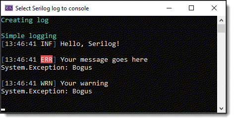

# Implement logging with Serilog

Logging can be critical to the success of an application, ranging from enterprise applications to those developed for personal projects. 

Without proper logging, imagine attempting to assist a customer or business user when visiting their location is impossible, and using Microsoft Teams or a similar application does not provide sufficient information to diagnose the problem.

By adding logging capabilities to an application, developers can save time diagnosing issues by receiving detailed logs directly from the application.

## Scope of information

There are many options and libraries for Serilog; the information provided should be considered the basics to intermediate level for logging.

## Log levels 

Before you begin logging, understand that .NET has six main logging levels:

| Level    |   Description    |
|:------------- |:-------------|
|  Critical| Identifies failures possibly leaving the app unable to function correctly. Exceptions such as out-of-memory and disk running out of space fall in this category. |
| Error |  Identifies errors and exceptions disrupting an operation, such as a database error preventing a record from being saved. Despite encountering errors for an operation, the application can continue functioning normally for other operations. |
| Warning |  A warning might not crash the application, but it’s an issue potentially leading to more critical errors. A warning is simply a level for alerting the administrator of a possible problem. |
| Information | Provides details about what’s happening behind the scenes in the application. Log messages can provide context when you need to understand the steps leading to an error. |
| Debug | Tracks detailed information useful during development. |
| Trace |  Also tracks detailed information and may include sensitive information such as passwords. It has minimal use and isn’t used at all by framework libraries. |

## Obsolete

As Serilog matures, some libraries may become obsolete. They may still work, but it is advised not to use them as they may break functionality down the road.

| Project        |   Description |
|:------------- |:-------------|
| BasicLogging1 |  This project shows logging to the console, which can be useful for learning and/or debugging as one learns how to code. | 
| SqlServerSink | This project shows how to log to a SQL-Server database using the NuGet package [Serilog.Sinks.MSSqlServer](https://www.nuget.org/packages/Serilog.Sinks.MSSqlServer/5.7.1?_src=template). Karen took this from the NuGet package repository site and made major changes, including using `net7`. |  
| HidePathInExceptions | This project showcases logging to a file. Note that the file Serilog.json is used to configure Serilog. There are two additional JSON files, one for disabling logging so a developer need not change code, only one setting. |  
| MultipleSubmitButtons2 | Example to show how to create custom Serilog color themes for the console in a Razor page project. |
| SerilogLibrary | Class project, currently contains methods to change colors for writing to the console. |
| WriteSeparateFromEfCore | Demonstrates Serilog writing to a log and EF Core to a different log. |
| WriteToNotePadApp | Demonstrates using a third-party sink to write logs to Notepad. |
| ConditionalLogging | Example to enable/disable logging using appsettings.json and a class for configuring logging. |
| ConditionalLoggingToggle | Helper utility for `ConditionalLogging` with full documentation. |
| LogForContext | Shows how to log to a file using [source contexts](https://github.com/serilog/serilog/wiki/Writing-Log-Events#source-contexts). |

# Which NuGet packages do I need?

In Solution Explorer, double-click on a project to open the project file and copy out what is needed.

Say these are what are needed:

<PackageReference Include="Microsoft.VisualStudio.Web.CodeGeneration.Design" Version="7.0.3" />
<PackageReference Include="Serilog.AspNetCore" Version="6.1.0" />
<PackageReference Include="Serilog.Extensions.Logging.File" Version="3.0.0" />
<PackageReference Include="Serilog.Sinks.Console" Version="4.1.0" />
<PackageReference Include="Serilog.Sinks.File" Version="5.0.0" />

Now open your project file and add:

<ItemGroup>

</ItemGroup>

Now paste the package references into the above group and save the project file.

<ItemGroup>
   <PackageReference Include="Microsoft.VisualStudio.Web.CodeGeneration.Design" Version="7.0.3" />
   <PackageReference Include="Serilog.AspNetCore" Version="6.1.0" />
   <PackageReference Include="Serilog.Extensions.Logging.File" Version="3.0.0" />
   <PackageReference Include="Serilog.Sinks.Console" Version="4.1.0" />
   <PackageReference Include="Serilog.Sinks.File" Version="5.0.0" />
</ItemGroup>

Lastly, open `Manage NuGet packages` for your project, check if there are any updates, and if so, update them.

# Setup

In short, install the `NuGet` packages [Serilog](https://www.nuget.org/packages/Serilog/2.12.0-dev-01555) for basics. In these code samples, we will use logging to files.

- [Serilog](https://www.nuget.org/packages/Serilog/2.12.0-dev-01555)
- [Serilog.Settings.AppSettings](https://www.nuget.org/packages/Serilog.Settings.AppSettings/2.2.3-dev-00066)
- [Serilog.Settings.Configuration](https://www.nuget.org/packages/Serilog.Settings.Configuration/3.3.1-dev-00337)
- [Serilog.Sinks.File](https://www.nuget.org/packages/Serilog.Sinks.File/5.0.0)

Once installed, these will be in the project file (you can take a fast track, open your project file, copy-n-paste, then save).

<ItemGroup>
    <PackageReference Include="Microsoft.Extensions.Configuration.Json" Version="6.0.0" />
    <PackageReference Include="Serilog" Version="2.11.0" />
    <PackageReference Include="Serilog.Settings.AppSettings" Version="2.2.2" />
    <PackageReference Include="Serilog.Settings.Configuration" Version="3.3.0" />
    <PackageReference Include="Serilog.Sinks.File" Version="5.0.0" />
</ItemGroup>

# Basic use

Example for writing to the console (see project BasicLogging1).

## Code in a console app

Add the following to a method.

using var log = new LoggerConfiguration()
    .WriteTo.Console()
    .CreateLogger();

Write information to the log:

using System.Runtime.CompilerServices;
using ConsoleHelperLibrary.Classes;
using Serilog;
using Spectre.Console;

namespace BasicLogging1;

internal class Program
{
    static void Main(string[] args)
    {
        AnsiConsole.MarkupLine("[cyan]Creating log[/]");
        Console.WriteLine();

        using var log = new LoggerConfiguration()
            .WriteTo.Console()
            .CreateLogger();

        AnsiConsole.MarkupLine("[cyan]Simple logging[/]");
        log.Information("Hello, Serilog!");
        Console.WriteLine();
        log.Error(new Exception("Bogus"), "Your message goes here");
        Console.WriteLine();
        log.Warning(new Exception("Bogus"), "Your warning");
        Console.WriteLine();
        Console.ReadLine();
    }
}

# Configuration Basics

Serilog uses a simple C# API to [configure](https://github.com/serilog/serilog/wiki/Configuration-Basics) logging. When external configuration is desirable, it can be mixed in (sparingly) using the [Serilog.Settings.AppSettings](https://github.com/serilog/serilog-settings-appsettings) package or [Serilog.Settings.Configuration](https://github.com/serilog/serilog-settings-configuration) package.

Although in the following example, which writes to a file, we will keep things simple for the sake of learning.

# Writing Log Events

Log events are written to sinks using the Log static class or the methods on an ILogger. These examples will use Log for syntactic brevity, but the same methods shown below are also available on the interface.

Once you have learned the basics, dive into [this page](https://github.com/serilog/serilog/wiki/Writing-Log-Events) for in-depth information on what is possible with logging beyond the basics.

## Writing to a database

For logging to a database, refer to the [Serilog MSSQL sink documentation](https://github.com/serilog-mssql/serilog-sinks-mssqlserver).

# Provided Sinks

Serilog provides [sinks](https://github.com/serilog/serilog/wiki/Provided-Sinks) for writing log events to storage in various formats. Many of the sinks listed below are developed and supported by the wider Serilog community; please direct questions and issues to the relevant repository.

[List of available sinks](https://github.com/serilog/serilog/wiki/Provided-Sinks#list-of-available-sinks)

# Serilog configuration (Settings-from-JSON)

This project demonstrates configuring Serilog from `appsettings.json` and programmatically via `SetupLogging`. The following section explains the configuration keys, where logs are written, required packages, and how the project uses Serilog at startup.

## Quick start

1. Restore NuGet packages.
2. Ensure `appsettings.json` is present in the application base directory.
3. Run the application. The project initializes Serilog from configuration in `SetupLogging.Development()`.

## appsettings.json (relevant section)

{
  "Serilog": {
    "Using": [
      "Serilog.Sinks.File"
    ],
    "MinimumLevel": {
      "Default": "Information"
    },
    "WriteTo": [
      {
        "Name": "File",
        "Args": {
          "path": "LogFiles\\.txt",
          "rollingInterval": "Day",
          "outputTemplate": "[{Timestamp:yyyy-MM-dd HH:mm:ss.fff}] [{Level}] {Message}{NewLine}{Exception}"
        }
      }
    ]
  }
}

**Notes:**
- The `Using` array loads sink assemblies (here `Serilog.Sinks.File`).
- `MinimumLevel.Default` controls the global minimum level (e.g., `Information`, `Debug`).
- The `WriteTo` array configures sinks. The sample config uses the `File` sink with `rollingInterval: Day` and a custom `outputTemplate`.
- Paths in the config are relative to the application base directory at runtime.

## How `SetupLogging` uses configuration

The project contains `SetupLogging.Development()` which reads `appsettings.json` and calls `ReadFrom.Configuration(...)` to build `Log.Logger`.

public static void Development()
{
    IConfigurationRoot configuration = new ConfigurationBuilder()
        .SetBasePath(AppDomain.CurrentDomain.BaseDirectory)
        .AddJsonFile("appsettings.json", optional: false, reloadOnChange: true)
        .Build();

    Log.Logger = new LoggerConfiguration()
        .ReadFrom.Configuration(configuration) // requires Serilog.Settings.Configuration package
        .CreateLogger();
}

Because `reloadOnChange` is `true`, changes to `appsettings.json` are picked up without restarting the application.

## Program startup and example usage

`Init()` calls `SetupLogging.Development()` during module initialization so Serilog is available early. Example of logging an exception from `Program.cs`:

catch (Exception e)
{
    Log.Error(e, "An error occurred while reading the file.");
}

## Where logs appear

- The `File` sink path in `appsettings.json` is relative to the app base directory. With `rollingInterval: Day`, the sink will create separate files per day (the exact filename behavior is controlled by the path and sink options).
- `SetupLogging.Development()` contains an alternate implementation that writes into `LogFiles\YYYY-MM-DD\Log.txt` to separate logs by date.

## Required NuGet packages

- `Serilog`
- `Serilog.Settings.Configuration` (enables `ReadFrom.Configuration`)
- `Serilog.Sinks.File` (or any other sink you need)
- `Microsoft.Extensions.Configuration` and `Microsoft.Extensions.Configuration.Json` (for reading `appsettings.json`)

Install with `dotnet add package <PackageName>` or via Visual Studio NuGet manager.

## Tips and troubleshooting

- If logs don't appear, verify the effective `MinimumLevel` and sink configuration in `appsettings.json`.
- Ensure the process has write permission to the `LogFiles` folder under the application base directory.
- Validate JSON syntax; typos in the `Serilog` section prevent configuration from loading.
- To change behavior for production, provide a different configuration file or call a different `SetupLogging` method.

## Summary

This repository shows how to centralize Serilog configuration in `appsettings.json` and initialize `Log.Logger` early in application startup using `SetupLogging.Development()`. Modify `appsettings.json` to change sinks, levels, and templates without recompiling.

# See also

- Serilog [home page](https://serilog.net/)
- Serilog [Best Practices](https://benfoster.io/blog/serilog-best-practices/) :heavy_check_mark:
- Seq [log viewer](https://datalust.co/seq)
- [Debugging and Diagnostics](https://github.com/serilog/serilog/wiki/Debugging-and-Diagnostics)
- [Formatting Output](https://github.com/serilog/serilog/wiki/Formatting-Output)
    - [Customized JSON formatting with Serilog](https://nblumhardt.com/2021/06/customize-serilog-json-output/)

# Closing thoughts

There are other logging libraries out there; this one may or may not be right for you. The best way to decide is to look over the code samples presented along with Serilog documentation.

What has been presented are the very basics, except for a few items like how to disable logging via the JSON configuration file, which is a plus as otherwise the developer must figure out how to disable it, perhaps with conditional statements, which simply clutters up the code of an application.

