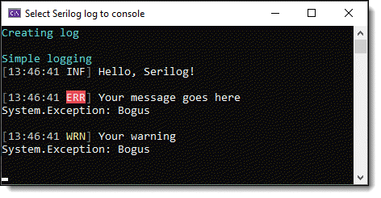

# Implement logging with Serilog


Logging can be critical to the success of an application which range from an enterprise application to an application and developer wrote to get paid for.

Without proper logging, imagine attempting to assist a customer or business user were going to their location is impossible and/or using Microsoft Teams or similar application does not provide sufficient information to diagnose the problem.


By adding logging capabilities to an application which than can be sent to the developer can save time figuring out a problem.

| Project        |   Description |
|:------------- |:-------------|
| BasicLogging1 |  This project shows logging to the console which can be useful for learning and/or for debugging as one learns how to code. | 
| CombinedConfigDemo | This project shows how to log to a SQL-Server database using NuGet package [Serilog.Sinks.MSSqlServer](https://www.nuget.org/packages/Serilog.Sinks.MSSqlServer/5.7.1?_src=template). Karen took this from the NuGet package repository site and made minor changes which include using `net6` |  
| HidePathInExceptions | This project showcases logging to a file. Note the file Serilog.json is used to configure SeriLog. There are two additional json files, one for disabling logging so a developer need not change code, only one setting. |  
|MultipleSubmitButtons2| Example to show how to create custom SeriLog color themes for the console in a Razor page project |
| SeriLogLibrary | Class project, currently contains methods to change colors for writing to the console. |
| WriteSeparateFromEfCore | Demonstrates SeriLog writing to a log and EF Core to a different log|


# Which NuGet packages do I need?

In Solution Explorer, double click on a project which will open the project file, copy out what is needed,

Say these are what are needed

```xml
<PackageReference Include="Microsoft.VisualStudio.Web.CodeGeneration.Design" Version="7.0.3" />
<PackageReference Include="Serilog.AspNetCore" Version="6.1.0" />
<PackageReference Include="Serilog.Extensions.Logging.File" Version="3.0.0" />
<PackageReference Include="Serilog.Sinks.Console" Version="4.1.0" />
<PackageReference Include="Serilog.Sinks.File" Version="5.0.0" />
```

Now open your project file and add

```xml
<ItemGroup>

</ItemGroup>
```

Now paste the package references into the above group and save the project file.

```xml
<ItemGroup>
   <PackageReference Include="Microsoft.VisualStudio.Web.CodeGeneration.Design" Version="7.0.3" />
   <PackageReference Include="Serilog.AspNetCore" Version="6.1.0" />
   <PackageReference Include="Serilog.Extensions.Logging.File" Version="3.0.0" />
   <PackageReference Include="Serilog.Sinks.Console" Version="4.1.0" />
   <PackageReference Include="Serilog.Sinks.File" Version="5.0.0" />
</ItemGroup>
```

Lastly, open `Manage NuGet packages` for your project, the references are there, see if there are any updates and if so update them.


# Setup

In short, install `NuGet` packages [Serilog](https://www.nuget.org/packages/Serilog/2.12.0-dev-01555) for basics. In these code samples will will use for logging to files.

- [Serilog](https://www.nuget.org/packages/Serilog/2.12.0-dev-01555)
- [Serilog.Settings.AppSettings](https://www.nuget.org/packages/Serilog.Settings.AppSettings/2.2.3-dev-00066)
- [Serilog.Settings.Configuration](https://www.nuget.org/packages/Serilog.Settings.Configuration/3.3.1-dev-00337)
- [Serilog.Sinks.File](https://www.nuget.org/packages/Serilog.Sinks.File/5.0.0)

Once installed these will be in the project file (you can take a fast track, open your project file, copy-n-paste then save).

```xml
<ItemGroup>
    <PackageReference Include="Microsoft.Extensions.Configuration.Json" Version="6.0.0" />
    <PackageReference Include="Serilog" Version="2.11.0" />
    <PackageReference Include="Serilog.Settings.AppSettings" Version="2.2.2" />
    <PackageReference Include="Serilog.Settings.Configuration" Version="3.3.0" />
    <PackageReference Include="Serilog.Sinks.File" Version="5.0.0" />
</ItemGroup>
```


# Basic use

Example for writing to the console `see project BasicLogging1`


## Code in a console app



Add the following to a method.

```csharp
using var log = new LoggerConfiguration()
    .WriteTo.Console()
    .CreateLogger();
```

Write information to the log

```csharp
using System.Runtime.CompilerServices;
using ConsoleHelperLibrary.Classes;
using Serilog;
using Spectre.Console;

namespace BasicLogging1;

internal class Program
{
    static void Main(string[] args)
    {
        AnsiConsole.MarkupLine("[cyan]Creating log[/]");
        Console.WriteLine();

        using var log = new LoggerConfiguration()
            .WriteTo.Console()
            .CreateLogger();

        AnsiConsole.MarkupLine("[cyan]Simple logging[/]");
        log.Information("Hello, Serilog!");
        Console.WriteLine();
        log.Error(new Exception("Bogus"), "Your message goes here");
        Console.WriteLine();
        log.Warning(new Exception("Bogus"),"Your warning");
        Console.WriteLine();
        Console.ReadLine();
    }
}
```

# Configuration Basics

Serilog uses a simple C# API to [configure](https://github.com/serilog/serilog/wiki/Configuration-Basics) logging. When external configuration is desirable it can be mixed in (sparingly) using the [Serilog.Settings.AppSettings](https://github.com/serilog/serilog-settings-appsettings) package or [Serilog.Settings.Configuration package](https://github.com/serilog/serilog-settings-configuration).


Although in the following example which writes to a file we will keep things simple for the sack of learning.

# Writing Log Events

Log events are written to sinks using the Log static class, or the methods on an ILogger. These examples will use Log for syntactic brevity, but the same methods shown below are available also on the interface.

Once you have learned the basics dive into [this page](https://github.com/serilog/serilog/wiki/Writing-Log-Events) for indepth information on what is possible with logging past the basics.

## Writing to a database

https://github.com/serilog-mssql/serilog-sinks-mssqlserver

# Provided Sinks

Serilog provides [sinks](https://github.com/serilog/serilog/wiki/Provided-Sinks) for writing log events to storage in various formats. Many of the sinks listed below are developed and supported by the wider Serilog community; please direct questions and issues to the relevant repository.

[List of available sinks](https://github.com/serilog/serilog/wiki/Provided-Sinks#list-of-available-sinks)


# See also

- SeriLog [home page](https://serilog.net/)
- Seq [log viewer](https://datalust.co/seq)
- [Customized JSON formatting with Serilog](https://nblumhardt.com/2021/06/customize-serilog-json-output/)


# Closing thoughts

There are other logging libraries out there, this one may or may not be right for you. The best way to decide is look over the code samples presented along with SeriLog documentation.

What has been presented are the very basics except for a few items like how to disable logging via the json configuration file which is a plus as otherwise the developer must figure out how to disable e.g. perhaps with conditional statements which simply clutters up the code of an application.

